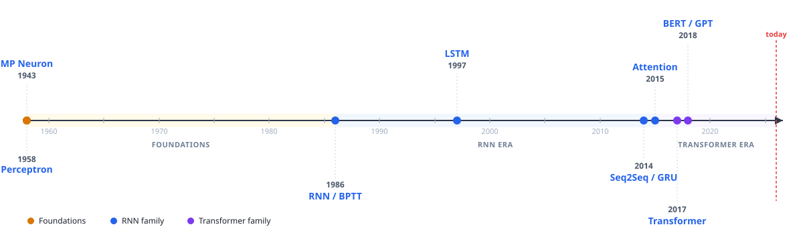

# nn_timeline

> A notes-first walk through the architectures that shaped modern deep learning —
> from the perceptron to the transformer. Each chapter pairs a science note
> (motivation, math, intuition) with a reference implementation in the `nn_timeline` package.



**Book:** [surafelml.github.io/nn-timeline](https://surafelml.github.io/nn-timeline)

---

## Updates

| Date | Status |
|---|---|
| 2026-05-31 | **Foundations complete** — all 7 notes published (MP neuron → optimization). RNN and Transformer chapters: stubs live, drafts in progress. |
| 2026-05-14 | Initial release — package skeleton, CI, notes infrastructure. |

---

## Motivation

The field moves fast, but understanding *why* each architecture superseded the last requires slowing down. `nn_timeline` is built around that premise: each milestone is a self-contained chapter — notes that trace the scientific reasoning, not just the implementation.

Most resources sit at three poles: textbooks (deep, stale), papers (deep, fragmented), blogs (current, shallow). The *"I want to understand how we got here and how this works, with code I can run"* middle ground is underserved. Timeline framing is forward-compatible: every new architecture slots into the existing lineage rather than orphaning prior content.

## What it is

- **Science notes**: Quarto `.qmd`, math and derivations before every line of code
- **Architecture timeline**: Perceptron → RNN → Attention → Transformer (versioned milestones, not a moving target)
- **Importable package**: `from nn_timeline.layers import MultiHeadAttention` *(coming — foundations notes are complete; layer implementations follow)*
- **Runnable on Mac M\* or a single GPU** — no cluster required

## Repository layout

```
nn_timeline/        # installable package (implementations follow notes)
  archs/            # rnn/, tnn/ — milestone architectures
  layers/           # attention/, embeddings/, ffn/, norm/, recurrent/
  train/            # Trainer, optimizer, scheduler, checkpoint
  metrics/          # BLEU, chrF, Perplexity
notes/              # Quarto .qmd — science notes, one concept per file
  00_foundations/   # complete: 7 notes, 1958–1991
  01_rnn/           # in progress
  02_transformer/   # in progress
tests/              # pytest suite, TDD red→green
```

## Notes

Notes live at [surafelml.github.io/nn-timeline](https://surafelml.github.io/nn-timeline).

Foundations chapters are available now. RNN and Transformer chapters are being added on a rolling basis.

## Ecosystem

All repos live under [`github.com/surafelml`](https://github.com/surafelml) with a shared `nn-timeline` prefix.

| Repo | Purpose |
|---|---|
| [`nn-timeline`](https://github.com/surafelml/nn-timeline) (this) | Core architectures, RNN → Transformer era |
| [`nn-timeline-ui`](https://github.com/surafelml/nn-timeline-ui) | Gradio demos, interactive timeline, experiment dashboard |
| `nn-timeline-{moe,alignment,…}` | Architecture-specific extensions |

## License

MIT
