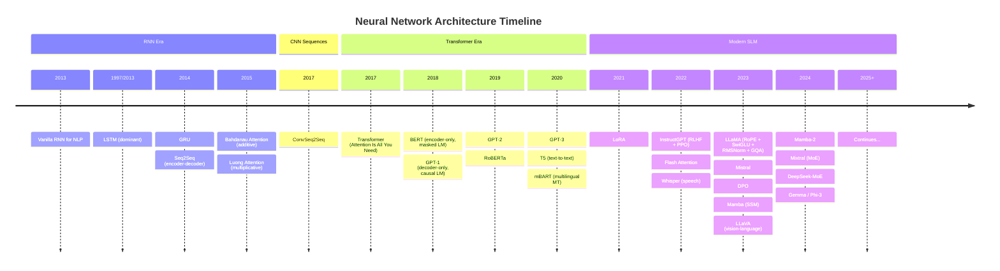

# nn_timeline — Design & SSOT Plan

> Single source of truth for the `nn_timeline` package: vision, architecture, API, roadmap, and conventions.

---

## Table of Contents

1. [Vision & Goals](#1-vision--goals)
2. [Non-Goals](#2-non-goals)
3. [Architecture Timeline](#3-architecture-timeline)
4. [Repository Structure](#4-repository-structure)
5. [Package & API Design](#5-package--api-design)
6. [Notes System](#6-notes-system)
7. [Demo Design](#7-demo-design)
8. [Training & Evaluation](#8-training--evaluation)
9. [Model Hosting & Distribution](#9-model-hosting--distribution)
10. [Website & Visualization Roadmap](#10-website--visualization-roadmap)
11. [Versioning & Release Strategy](#11-versioning--release-strategy)
12. [Phased Roadmap](#12-phased-roadmap)
13. [Contributing & Maintenance](#13-contributing--maintenance)
14. [Appendix A — Existing Tools Landscape](#appendix-a--existing-tools-landscape)
15. [Appendix B — Architecture Timeline Diagram](#appendix-b--architecture-timeline-diagram)
16. [Appendix C — Interactive Tool Layer Design](#appendix-c--interactive-tool-layer-design)

---

## 1. Vision & Goals

**`nn_timeline`** is a minimal, clean, PyTorch-only educational package that traces the full arc of neural network architectures from RNN through modern SLMs — organized by architecture family, continuously updated, and usable as both a learning resource and an importable library.

### Core Goals

| Goal | Description |
|---|---|
| **Educational first** | Every component prioritizes clarity over cleverness. Code is the primary explanation. |
| **Timeline as narrative** | The repo is organized by architecture family in chronological order. A student can navigate the evolution of the field through the codebase. |
| **Importable package** | Other educational repos can `from nn_timeline.layers import RoPE` without pulling in the whole training stack. |
| **Runnable on a single GPU or Mac M*** | All implementations must train and infer on consumer hardware. Multi-GPU is supported but never required. |
| **Code is the SSOT** | Notes import from the live package. As the code evolves, notes stay linked to the canonical implementation. |
| **Demo = real-world usage** | Demos run trained/tuned models against real tasks (translation, chat). Demo apps live in `nn_timeline_ui` and depend on this package. |

### Guiding Principle

> Smallest code footprint that is still functionally complete and pedagogically honest.

This means: one clean canonical implementation per concept, not exhaustive variants. Three similar lines over a premature abstraction. No half-implemented stubs left in the main branch.

### Package Ecosystem

`nn_timeline` is one of two repositories. The dependency arrow is strictly one-way.

```
nn_timeline          (this repo — core, stable, minimal deps)
  archs / layers / models / tasks / data / train / generate / metrics / notes
  Dependencies: torch, numpy, sentencepiece

        ▲
        │ depends on
        │

nn_timeline_ui       (separate repo — interactive layer)
  Gradio apps / Plotly timeline picker / ipywidgets / CLI wizard /
  experiment registry / MCP server wrapper
  Dependencies: nn_timeline + gradio + plotly + ipywidgets + ...
```

`nn_timeline` knows nothing about `nn_timeline_ui`. Notes in `nn_timeline` degrade gracefully if `nn_timeline_ui` is not installed — base notebooks (math + static matplotlib) work with `pip install nn-timeline` alone. Interactive widget enhancements are opt-in via `pip install nn-timeline-ui`.

---

## 2. Non-Goals

- Production-grade serving infrastructure
- Exhaustive hyperparameter search or AutoML
- Support for frameworks other than PyTorch
- Replication of benchmark SOTA numbers
- TensorFlow or JAX ports (explicitly deferred)
- Perceptron / MLP implementations in code (covered in notes only)
- Multi-framework unified API
- Interactive UI, Gradio apps, Plotly visualizations, CLI wizard → `nn_timeline_ui`
- Experiment registry and HF Hub run sync → `nn_timeline_ui`
- MCP server wrapper → `nn_timeline_ui` (Phase 3)
- Visualization apps (attention heatmaps, embedding PCA in UI) → `nn_timeline_ui`

---

## 3. Architecture Timeline

The timeline is the spine of the repo. Each family is a module. Within each family, implementations are minimal and annotated.

> **Notes-only zone**: Perceptron, MLP, backpropagation — covered in `notes/00_foundations/` but no corresponding `archs/` code.

> **Experimental zone**: SSMs, MoE, multimodal — live in `nn_timeline/experimental/` until stable.

### Family Map

```
RNN Family (2013–2017)
├── Vanilla RNN
├── LSTM                         Hochreiter & Schmidhuber, 1997 / dominant ~2013
├── GRU                          Cho et al., 2014
├── Seq2Seq (RNN encoder-decoder) Sutskever et al., 2014
├── Bahdanau Attention            Bahdanau et al., 2015  (additive)
└── Luong Attention               Luong et al., 2015     (multiplicative)

CNN for Sequences (2017)
└── ConvSeq2Seq                  Gehring et al., 2017

Transformer Family (2017–2021)
├── Original Transformer          Vaswani et al., 2017
├── BERT (encoder-only, masked LM) Devlin et al., 2018
├── GPT-1/2 (decoder-only, causal LM) Radford et al., 2018/2019
├── T5 (encoder-decoder, text-to-text) Raffel et al., 2020
└── mBART / multilingual MT       Liu et al., 2020

Modern SLM Architecture (2022–present)
├── LLaMA-style                  Touvron et al., 2023
│   ├── RoPE positional embeddings
│   ├── SwiGLU activation
│   ├── RMSNorm
│   ├── Grouped Query Attention (GQA)
│   └── KV-Cache
├── Flash Attention               Dao et al., 2022
├── Mistral                       Jiang et al., 2023
└── Phi / Gemma (small but capable)

Alignment & Fine-tuning (2022–present)
├── RLHF + PPO                   Ouyang et al., 2022 (InstructGPT)
├── DPO                          Rafailov et al., 2023
└── LoRA / QLoRA                 Hu et al., 2021 / Dettmers et al., 2023

State Space Models — experimental (2021–present)
├── S4                           Gu et al., 2021
├── Mamba                        Gu & Dao, 2023
└── Mamba-2 / Hybrid (Jamba)     2024

Mixture of Experts — experimental (2021–present)
├── Switch Transformer            Fedus et al., 2021
├── Mixtral                       Mistral AI, 2023
└── DeepSeek-MoE                 DeepSeek, 2024

Multimodal — experimental (2021–present)
├── CLIP (vision-language)        Radford et al., 2021
├── Whisper (speech-to-text)      Radford et al., 2022
└── LLaVA-style                  Liu et al., 2023
```

### Tasks Covered Per Family

| Task | RNN | TNN | Modern SLM | SSM | Multimodal |
|---|---|---|---|---|---|
| Language Modeling | LSTM LM | GPT-style | LLaMA-style | Mamba LM | — |
| Machine Translation | Seq2Seq | Transformer | Fine-tuned SLM | — | — |
| Masked LM | — | BERT | — | — | — |
| Speech-to-Text | — | — | Whisper-style | — | v3 |
| Vision-Language | — | — | — | — | v3 |

---

## 4. Repository Structure

```
nn_timeline/
│
├── nn_timeline/                  # Importable Python package
│   ├── __init__.py
│   │
│   ├── archs/                    # Architecture families (stable)
│   │   ├── rnn/
│   │   │   ├── __init__.py
│   │   │   ├── rnn.py            # Vanilla RNN
│   │   │   ├── lstm.py
│   │   │   ├── gru.py
│   │   │   └── seq2seq.py        # RNN encoder-decoder
│   │   ├── tnn/
│   │   │   ├── __init__.py
│   │   │   ├── transformer.py    # Original Transformer
│   │   │   ├── bert.py           # Encoder-only
│   │   │   ├── gpt.py            # Decoder-only
│   │   │   └── t5.py             # Encoder-decoder, text-to-text
│   │   └── slm/
│   │       ├── __init__.py
│   │       ├── llama.py          # LLaMA-style (RoPE+SwiGLU+RMSNorm+GQA)
│   │       └── mistral.py
│   │
│   ├── experimental/             # Archs not yet stable
│   │   ├── __init__.py
│   │   ├── archs/
│   │   │   ├── ssm/
│   │   │   │   ├── s4.py
│   │   │   │   └── mamba.py
│   │   │   ├── moe/
│   │   │   │   └── moe_layer.py
│   │   │   └── multimodal/
│   │   │       ├── clip.py
│   │   │       └── whisper.py
│   │   └── align/
│   │       ├── rlhf.py           # PPO
│   │       └── dpo.py
│   │
│   ├── layers/                   # Composable primitives (most importable surface)
│   │   ├── attention/
│   │   │   ├── bahdanau.py       # Additive attention
│   │   │   ├── luong.py          # Multiplicative attention
│   │   │   ├── mha.py            # Multi-head attention
│   │   │   ├── gqa.py            # Grouped query attention
│   │   │   └── flash.py          # Flash attention wrapper
│   │   ├── embeddings/
│   │   │   ├── token.py
│   │   │   ├── sinusoidal.py
│   │   │   ├── learned.py
│   │   │   ├── rope.py           # Rotary positional embeddings
│   │   │   └── alibi.py          # ALiBi
│   │   ├── norm/
│   │   │   ├── layer_norm.py
│   │   │   └── rms_norm.py
│   │   ├── ffn/
│   │   │   ├── feedforward.py    # Standard FFN
│   │   │   └── swiglu.py         # SwiGLU / GeGLU
│   │   └── recurrent/
│   │       ├── rnn_cell.py
│   │       ├── lstm_cell.py
│   │       └── gru_cell.py
│   │
│   ├── models/                   # Task-level model wrappers
│   │   ├── encoder_decoder.py
│   │   ├── encoder_only.py
│   │   └── decoder_only.py
│   │
│   ├── tasks/                    # Training task definitions
│   │   ├── base.py
│   │   ├── language_model.py
│   │   ├── translation.py
│   │   └── masked_lm.py
│   │
│   ├── data/                     # Data pipeline
│   │   ├── dictionary.py
│   │   ├── bpe.py                # Bundled minimal BPE tokenizer
│   │   ├── datasets/
│   │   │   ├── langpair.py
│   │   │   ├── lm_dataset.py
│   │   │   └── indexed.py
│   │   └── iterators.py
│   │
│   ├── train/                    # Training infrastructure
│   │   ├── trainer.py
│   │   ├── optimizer.py
│   │   ├── scheduler.py          # InvSqrtRoot + cosine decay
│   │   └── checkpoint.py
│   │
│   ├── generate/                 # Inference
│   │   ├── generator.py          # Beam search + sampling
│   │   ├── search.py
│   │   └── kv_cache.py
│   │
│   ├── metrics/                  # All eval logic lives here
│   │   ├── bleu.py
│   │   ├── chrf.py
│   │   ├── comet.py              # Wrapper (requires comet-ml)
│   │   ├── perplexity.py
│   │   └── meters.py
│   │
│   ├── align/                    # Stable alignment methods
│   │   └── lora.py
│   │
│   ├── configs/                  # Dataclass-based configs
│   │   ├── base.py
│   │   ├── rnn_configs.py
│   │   ├── tnn_configs.py
│   │   └── slm_configs.py
│   │
│   ├── utils/
│   │   ├── helpers.py
│   │   ├── registry.py
│   │   ├── file_io.py
│   │   └── device.py             # MPS / CUDA / CPU abstraction
│   │
│   └── archs/
│       └── timeline_registry.py  # Arch metadata: year, family, key innovation,
│                                 # note path — shared source of truth for both repos
│
├── cli/                          # Basic entry-point scripts (no wizard — that is nn_timeline_ui)
│   ├── train.py
│   ├── preprocess.py
│   ├── generate.py
│   └── evaluate.py
│
├── notes/                        # Educational content (Jupyter + Quarto)
│   ├── 00_foundations/           # Notes-only, no arch code
│   │   ├── backprop.ipynb
│   │   ├── mlp.ipynb
│   │   └── gradient_flow.ipynb
│   ├── 01_rnn/
│   │   ├── rnn_intuition.ipynb
│   │   ├── lstm_gru.ipynb
│   │   ├── seq2seq.ipynb
│   │   └── attention_bahdanau.ipynb
│   ├── 02_transformer/
│   │   ├── self_attention.ipynb
│   │   ├── transformer_walkthrough.ipynb
│   │   ├── bert_gpt.ipynb
│   │   └── positional_encoding.ipynb
│   ├── 03_modern_slm/
│   │   ├── rope_swiglu_rmsnorm.ipynb
│   │   ├── llama_arch.ipynb
│   │   ├── kv_cache.ipynb
│   │   └── flash_attention.ipynb
│   ├── 04_alignment/
│   │   ├── rlhf_ppo.ipynb
│   │   ├── dpo.ipynb
│   │   └── lora.ipynb
│   ├── 05_ssm/                   # Experimental
│   │   ├── s4.ipynb
│   │   └── mamba.ipynb
│   ├── 06_tasks/
│   │   ├── machine_translation.ipynb
│   │   └── language_modeling.ipynb
│   └── _quarto.yml               # Renders notes/ → GitHub Pages
│
├── models/                       # HuggingFace Hub pointers + model cards
│   └── README.md
│
├── tests/
│   ├── test_layers.py
│   ├── test_archs.py
│   ├── test_data.py
│   └── test_generate.py
│
├── ssot_plan.md                  # This document
├── pyproject.toml
├── README.md
└── LICENSE                       # MIT
```

---

## 5. Package & API Design

### Design Principles

1. **Stable vs. experimental split** — anything not battle-tested lives under `nn_timeline.experimental`. External packages should only import from stable.
2. **Layers are the primary import surface** — archs build on layers. Other packages mostly want layers, not full archs.
3. **Unified interface within families** — all encoder-decoder models expose `forward(src, tgt)`. All decoder-only models expose `forward(x)`. RNN models expose the same interface as Transformer models at the task level.
4. **No magic** — no hidden global state, no framework-specific tricks that break when the PyTorch version changes.

### Stable Import Surface

```python
# Architecture families
from nn_timeline.archs.rnn import RNN, LSTM, GRU, Seq2SeqRNN
from nn_timeline.archs.tnn import Transformer, BERT, GPT, T5
from nn_timeline.archs.slm import LLaMA, Mistral

# Composable layers — the richest import surface
from nn_timeline.layers.attention import (
    BahdanauAttention,       # additive, RNN-era
    LuongAttention,          # multiplicative, RNN-era
    MultiHeadAttention,      # Vaswani 2017
    GroupedQueryAttention,   # modern SLM
)
from nn_timeline.layers.embeddings import (
    TokenEmbedding,
    SinusoidalPE,            # original Transformer
    LearnedPE,
    RoPE,                    # LLaMA / modern
    ALiBi,
)
from nn_timeline.layers.norm import LayerNorm, RMSNorm
from nn_timeline.layers.ffn  import FeedForward, SwiGLU
from nn_timeline.layers.recurrent import RNNCell, LSTMCell, GRUCell

# Task-level model wrappers
from nn_timeline.models import EncoderDecoder, EncoderOnly, DecoderOnly

# Task runners
from nn_timeline.tasks import Translate, LanguageModel, MaskedLM

# Data
from nn_timeline.data import Dictionary, BPETokenizer
from nn_timeline.data.datasets import LanguagePairDataset, LMDataset
from nn_timeline.data import DataIterator

# Training
from nn_timeline.train import Trainer

# Generation
from nn_timeline.generate import SequenceGenerator

# Metrics
from nn_timeline.metrics import BLEU, chrF, Perplexity

# Alignment (stable)
from nn_timeline.align import LoRA
```

### Experimental Import Surface

```python
from nn_timeline.experimental.archs.ssm  import S4, Mamba
from nn_timeline.experimental.archs.moe  import MixtureOfExperts
from nn_timeline.experimental.archs.multimodal import Whisper, CLIPEncoder
from nn_timeline.experimental.align import PPOTrainer, DPOTrainer
```

### Unified Task Interface

All models, regardless of family, present consistent signatures at the task level:

```python
# Encoder-decoder (MT) — same interface for RNN and Transformer
model = Seq2SeqRNN(config)   # or Transformer(config)
logits = model(src, tgt)     # identical call

# Decoder-only (LM) — same interface for LSTM-LM and GPT
model = LSTM(config)         # or GPT(config)
logits = model(x)

# Trainer is arch-agnostic
trainer = Trainer(model, task=Translate, config=cfg)
trainer.train()
```

### Device Abstraction

All code routes through `nn_timeline.utils.device`:

```python
from nn_timeline.utils.device import get_device
device = get_device()  # returns: cuda | mps | cpu, in that priority order
```

No CUDA assumptions anywhere in the codebase.

---

## 6. Notes System

### Philosophy

Notes go beyond documentation. Each notebook is a self-contained lesson that:
- Imports live code from `nn_timeline` (code is always the SSOT)
- Derives and annotates the math inline
- Includes diagrams and visualizations (matplotlib / plotly, living in the notebook)
- Is runnable on Colab or locally with a single `pip install nn-timeline`

### Format

| Layer | Tool | Output |
|---|---|---|
| Primary content | Jupyter Notebooks | Interactive, executable |
| Published form | Quarto | GitHub Pages website |
| Math | LaTeX in markdown cells | Rendered in both Jupyter and Quarto |
| Visualizations | matplotlib / plotly | Inline in notebooks, rendered on site |

### Notebook ↔ Code Mapping Convention

Every notebook begins with a mapping header:

```markdown
## Code References
- Architecture: `nn_timeline.archs.tnn.transformer`
- Key layers: `nn_timeline.layers.attention.mha`, `nn_timeline.layers.embeddings.sinusoidal`
- Config: `nn_timeline.configs.tnn_configs.TransformerConfig`
```

Every source file includes a reciprocal docstring reference:

```python
# Notes: notes/02_transformer/self_attention.ipynb
class MultiHeadAttention(nn.Module):
    ...
```

### Quarto Site

`notes/_quarto.yml` configures the site. Running `quarto render notes/` produces a navigable website mirroring the timeline structure. Hosted on GitHub Pages at `https://nn-timeline.github.io` (or similar).

---

## 7. Demo Design

> **Demos live in `nn_timeline_ui`**, not in this repo. This section documents the contract that `nn_timeline` must satisfy so that `nn_timeline_ui` can build on top of it cleanly.

### What nn_timeline Must Expose for Demos to Work

| Requirement | Where in nn_timeline |
|---|---|
| `load_from_hub(model_id)` — loads checkpoint from HF Hub | `train/checkpoint.py` |
| `SequenceGenerator` with streamed output | `generate/generator.py` |
| Structured return types from `Trainer` and metrics | `train/trainer.py`, `metrics/` |
| `timeline_registry.py` — arch metadata for picker UI | `archs/timeline_registry.py` |
| `nn_timeline.explain(layer, input)` — returns tensors (attention maps, activations) | `utils/explain.py` (Phase 2) |

### Demo Inventory (in nn_timeline_ui)

| Demo | Task | Key feature |
|---|---|---|
| MT demo | Translation | Cross-attention heatmap overlay |
| Chat demo | Language modeling | Streamed output, temperature / top-p sliders |
| Experiment dashboard | Build / train / compare / infer / internals | Unified Gradio app, timeline picker as arch selector |

### Demo Principles (enforced in nn_timeline_ui)

- Zero-install path: checkpoints load from HF Hub on first run
- Models small enough to run on CPU (for HF Spaces) and fast on M* / GPU
- No math visualization in demos — that lives in notes
- Every arch selection links to the relevant note notebook

---

## 8. Training & Evaluation

### Training Stack

| Component | Implementation |
|---|---|
| Optimizer | AdamW (primary), SGD (for RNN comparison) |
| Scheduler | Inverse square root (original TNN), cosine decay with warmup (modern SLM) |
| Precision | bf16 on CUDA / MPS where supported, fp32 fallback |
| Multi-GPU | DDP via PyTorch — always optional, never required |
| Gradient accumulation | Supported for effective large batch on single GPU |
| Checkpointing | Gradient checkpointing for large models on limited VRAM |

### Evaluation — `src/metrics/`

All metric logic is owned in-repo. External model-based metrics (COMET) are wrappers that declare the dependency explicitly.

| Metric | Task | Notes |
|---|---|---|
| BLEU | MT | Bundled |
| chrF | MT | Bundled |
| COMET | MT | Optional dependency (`comet-ml`) |
| Perplexity | LM | Bundled |
| Accuracy | MLM | Bundled |

### Scale Targets

All models must train to a meaningful result on:
- Mac M1/M2/M3 (MPS, ≤ 16 GB unified memory)
- Single consumer GPU (≤ 24 GB VRAM)
- Training time: hours, not days, for the small canonical configs

---

## 9. Model Hosting & Distribution

### HuggingFace Hub

Pre-trained checkpoints are hosted on HuggingFace Hub under `nn-timeline/` organization.

Each model has:
- A `model_card.md` describing arch, training data, config, and performance
- A version tag matching the package release that trained it
- A `config.json` loadable via `nn_timeline` config classes

### Loading Convention

```python
from nn_timeline.train.checkpoint import load_from_hub

model = load_from_hub("nn-timeline/transformer-mt-en-de-small")
```

### Naming Convention

`nn-timeline/{arch}-{task}-{src}-{tgt}-{size}`

Examples:
- `nn-timeline/transformer-mt-en-de-small`
- `nn-timeline/llama-lm-en-small`
- `nn-timeline/lstm-mt-en-am-small`  (Amharic — low-resource target)

---

## 10. Website & Visualization Roadmap

Staged deliberately — content before presentation. Ownership split across the two repos.

| Stage | Repo | What |
|---|---|---|
| v1 — Quarto site | `nn_timeline` | Notes rendered to GitHub Pages via `_quarto.yml`. Static timeline diagram in README. Zero extra stack. |
| v2 — Interactive timeline page | `nn_timeline_ui` | Plotly-based clickable timeline page. Arch node → config panel + note link. Backed by `timeline_registry.py` from `nn_timeline`. Built after Phase 1 content matures. |
| v3 — Full experiment dashboard | `nn_timeline_ui` | Unified Gradio app: Build / Train / Compare / Infer / Internals tabs. Deployed to HF Spaces. Built in Phase 2/3 of `nn_timeline_ui`. |

**Rationale for staging**: content quality drives adoption; the UI amplifies it. The Quarto site is free — it falls out of the notes system. Everything else waits until the architecture implementations are solid.

---

## 11. Versioning & Release Strategy

### Package Versioning — Semantic

```
MAJOR.MINOR.PATCH

1.0.0  — RNN family + original Transformer stable, PyPI published
1.1.0  — Modern SLM (LLaMA-style) added to stable
1.2.0  — Alignment (LoRA, DPO) added to stable
2.0.0  — Breaking API change (rare, requires migration guide)
```

### Stable vs. Experimental

- `nn_timeline.*` — semver-guaranteed, PyPI
- `nn_timeline.experimental.*` — no stability guarantees, importable by path

### HuggingFace Hub Tags

Each checkpoint is tagged `v{MAJOR.MINOR}` matching the package version that trained it.

### Branch Strategy

- `main` — stable, always installable
- `dev` — integration branch for incoming work
- `exp/{name}` — experimental arch branches before merging to `dev`

### Licensing

MIT. All bundled code, notes, and pre-trained model weights are MIT licensed.

---

## 12. Phased Roadmap

> Two repos, two roadmaps. This section covers `nn_timeline` (core) only.
> `nn_timeline_ui` roadmap is maintained in its own repo once created.
> UI items are noted below as triggers — they begin when the corresponding core phase ships.

### Phase 1 — Foundation: sitMT → nn_timeline

> Target: `nn_timeline` v1.0.0

- [ ] Repo rename and restructure to match directory layout in Section 4
- [ ] `archs/timeline_registry.py` — arch metadata (year, family, innovation, note path)
- [ ] Migrate existing TNN (Transformer) implementation to `archs/tnn/`
- [ ] Implement RNN family: Vanilla RNN, LSTM, GRU, Seq2SeqRNN
- [ ] Implement Bahdanau + Luong attention in `layers/attention/`
- [ ] Implement full embeddings library: Sinusoidal, Learned, RoPE, ALiBi
- [ ] Bundle minimal BPE tokenizer in `data/bpe.py`
- [ ] Device abstraction (`utils/device.py`) — MPS / CUDA / CPU
- [ ] Structured return types on `Trainer`, `SequenceGenerator`, `metrics`
- [ ] `train/checkpoint.py` — `load_from_hub()` for HF Hub checkpoints
- [ ] pyproject.toml + MIT license — package installable via pip
- [ ] Unit tests for all layers and key archs
- [ ] Quarto setup + GitHub Pages deploy (v1 web)
- [ ] HuggingFace Hub: first checkpoint (small Transformer MT en→de or en→am)
- [ ] Notes: `00_foundations` through `02_transformer`

> **nn_timeline_ui trigger**: create `nn_timeline_ui` repo, wire MT demo against v1.0.0 checkpoint.

### Phase 2 — Modern LLM Era

> Target: `nn_timeline` v1.1.0

- [ ] Modern SLM (LLaMA-style): RoPE, SwiGLU, RMSNorm, GQA, KV-Cache
- [ ] GPT-style decoder-only training loop
- [ ] Flash Attention integration (optional dependency)
- [ ] AdamW + cosine decay scheduler
- [ ] bf16 / gradient checkpointing support
- [ ] chrF + COMET metrics
- [ ] LoRA in `align/`
- [ ] `utils/explain.py` — returns attention maps / activations as tensors
- [ ] Notes: `03_modern_slm`
- [ ] HF Hub: small LLaMA-style checkpoint

> **nn_timeline_ui trigger**: add chat demo + interactive Plotly timeline picker (v2 web).

### Phase 3 — Alignment & Advanced Archs

> Target: `nn_timeline` v1.2.0

- [ ] RLHF (PPO) + DPO in `experimental/align/`
- [ ] S4 + Mamba in `experimental/archs/ssm/`
- [ ] MoE layer in `experimental/archs/moe/`
- [ ] DDP multi-GPU support (always optional)
- [ ] Notes: `04_alignment`, `05_ssm`
- [ ] Low-resource MT tutorial: Amharic ↔ English

> **nn_timeline_ui trigger**: full experiment dashboard (Build/Train/Compare/Infer/Internals) + MCP server wrapper.

### Phase 4 — Multimodal & Scale

> Target: `nn_timeline` v2.0.0

- [ ] Whisper-style Speech-to-Text in `experimental/archs/multimodal/`
- [ ] Vision-Language (CLIP, LLaVA-style)
- [ ] Notes: multimodal section
- [ ] API review — any breaking changes bundled here with migration guide

---

## 13. Contributing & Maintenance

### Code Style

- Black + isort for formatting
- Type hints on all public functions
- No comments that describe what the code does — only why (non-obvious constraints, invariants, paper-specific decisions)
- One canonical implementation per concept, not exhaustive variants

### Adding a New Architecture

1. Add implementation under `archs/{family}/` or `experimental/archs/{family}/`
2. Add corresponding note notebook under `notes/{section}/`
3. Add note↔code mapping header to the notebook and docstring reference to the source file
4. Add unit tests in `tests/test_archs.py`
5. Add a config dataclass in `configs/`
6. Update Appendix B diagram

### Adding a New Layer

1. Add under `layers/{category}/`
2. Export from `nn_timeline.layers.__init__`
3. Add to the stable import surface section of this document
4. Add unit test

### Experimental → Stable Promotion

An experimental component is promoted to stable when:
- It has a corresponding note notebook
- It has unit tests
- It runs cleanly on single GPU and Mac M*
- At least one trained checkpoint exists on HF Hub

---

## Appendix A — Existing Tools Landscape

> Included for motivation and positioning. Updated as the landscape evolves.

| Tool / Resource | Scope | Key Gap vs. nn_timeline |
|---|---|---|
| **d2l.ai** | Full timeline RNN→Transformer→modern, multi-framework, comprehensive math | Massive codebase, multi-framework, not importable as a package, no MT focus |
| **labml.ai** | Annotated paper implementations across many archs | Paper-by-paper, no unified API, no demo, no MT first-class |
| **Karpathy series** (micrograd→makemore→nanoGPT→llm.c) | LM timeline, minimal code, excellent pedagogy | Separate repos, LM only, not a package, no MT |
| **The Annotated Transformer** (Harvard NLP) | Single paper, deep annotation | Transformer only, frozen in 2017 |
| **Annotated S4 / Mamba** | SSM deep-dive | Single arch, no timeline |
| **minGPT / nanoGPT** | Minimal GPT-2 | LM only, no MT, not importable as package |
| **fast.ai** | Practical DL, good notebooks | Top-down pedagogy, not architecture-timeline organized |
| **OpenNMT / FairSeq** | Production MT | Not educational, overwhelming codebase |
| **HuggingFace Transformers** | Production model hub | Production-grade, not minimal, not timeline-organized |

**The unique position**: no existing resource is simultaneously (a) a clean importable PyPI package, (b) organized as an architecture timeline from RNN through modern SLMs, (c) treats LM and MT as first-class tasks, (d) ships with real deployable demos, and (e) stays small enough to run on a MacBook.

---

## Appendix B — Architecture Timeline Diagram



---

*Last updated: 2026-04-23*
*Status: Pre-implementation — design phase complete, all design decisions locked, two-repo split confirmed (nn_timeline + nn_timeline_ui), Phase 1 implementation pending*

---

## Appendix C — Interactive Tool Layer Design

> **Reference**: Brainstormed 2026-04-23. Design decisions resolved 2026-04-23. Informs Phase 2+ implementation and the long-term positioning of `nn_timeline` as an orchestratable tool, not just a library.
>
> Cross-references: Section 7 (Demo Design), Section 10 (Website & Visualization Roadmap), Section 12 (Phased Roadmap — Phase 3+).
>
> C.5 status: **all four decisions locked** — see C.5 for details.

---

### C.1 Core Insight

`nn_timeline` is already shaped correctly — clean importable API, config-driven, task-agnostic. The interactive tool is the **interaction layer above the package API**: a surface that lets someone build, train, infer, and compare neural architectures without writing code, or lets an LLM agent do it on their behalf.

The differentiator: when you pick LSTM vs Transformer in any interface, the tool doesn't just run both — it links to the note that explains *why they differ*, *what the Transformer introduced*, and *what you'd expect to see in the results*. The interactive surface and the educational content are the same system.

---

### C.2 Full Stack Diagram

```
┌─────────────────────────────────────────────────────┐
│                  USER / RESEARCHER                  │
└────────────────────────┬────────────────────────────┘
                         │
         ┌───────────────┼───────────────┐
         │               │               │
         ▼               ▼               ▼
   Natural Lang      Notebook         Web App
   ("train a         (ipywidgets,     (Gradio /
    small LSTM        live plots)      Streamlit)
    for MT")
         │               │               │
         └───────────────┼───────────────┘
                         │
                         ▼
          ┌──────────────────────────────┐
          │   Interactive CLI Layer      │
          │   nn_timeline build / run    │  ← wizard, config builder,
          └──────────────┬───────────────┘    comparison mode
                         │
                         ▼
          ┌──────────────────────────────┐
          │    nn_timeline Package API   │  ← SSOT (Sections 4–5)
          │  archs / layers / tasks /    │
          │  train / metrics / generate  │
          └──────────────┬───────────────┘
                         │
                         ▼
          ┌──────────────────────────────┐
          │   Hardware: MPS / GPU / CPU  │
          └──────────────────────────────┘
```

---

### C.3 The Four Interaction Modes

> Ownership summary: Modes 1, 3, 4 live in `nn_timeline_ui`. Mode 2 straddles both — base notebook content in `nn_timeline`, interactive widget enhancements in `nn_timeline_ui`.

#### Mode 1 — CLI Wizard (`nn_timeline build`) — **nn_timeline_ui**

A conversational terminal flow. Lowest friction entry point for students
who know their goal but not the configuration.

```
$ nn_timeline build

  What task?        [translation / language-model / masked-lm]  > translation
  Source language?  > en
  Target language?  > am
  Data path?        > ./data/en-am/
  Compute budget?   [mac-m / single-gpu / multi-gpu]             > mac-m
  Architecture?     [auto / rnn / transformer / slm]             > auto

  → Recommending: Transformer (small config)
    Reason: translation task, mac-m budget, <100k pairs estimated
    Config written to: ./experiments/en-am-transformer-small/config.yaml

$ nn_timeline train ./experiments/en-am-transformer-small/config.yaml
$ nn_timeline evaluate ./experiments/en-am-transformer-small/ --metric bleu chrf
$ nn_timeline compare ./experiments/run-a/ ./experiments/run-b/
```

**What this needs from the package:**
- `nn_timeline.build(arch, task, ...)` — programmatic config factory
- Experiment registry (local JSON/SQLite) so `compare` can reference named runs

---

#### Mode 2 — Notebook Interactive Mode (ipywidgets) — **nn_timeline (base) + nn_timeline_ui (enhancements)**

For students working inside Jupyter. Widgets wrap the config and training
loop without leaving the notebook environment where notes already live.

```
┌─────────────────────────────────────────────┐
│  Architecture:  [LSTM ▼]   Task: [MT ▼]     │
│  Embed dim:     [──●──────] 256              │
│  Layers:        [─●───────] 2                │
│  Attention:     [Bahdanau ▼]                 │
│                                              │
│  [ Build Model ]  [ Estimate Params ]        │
├─────────────────────────────────────────────┤
│  TRAINING                                    │
│  Epoch 3/10  Loss: 2.41 → 1.87              │
│  [████████░░░░░░░░░░] 42%                   │
│  [ Stop ]  [ Save Checkpoint ]               │
├─────────────────────────────────────────────┤
│  COMPARE MODE                                │
│  LSTM  ──────────────────\                  │
│  TNN   ─────────────────────\               │
│                               BLEU vs epoch  │
└─────────────────────────────────────────────┘
```

Notes already import the package — adding widgets keeps the student in one
environment. The architecture picker can be the clickable timeline diagram.

---

#### Mode 3 — Web App (Gradio, unified experiment dashboard) — **nn_timeline_ui**

Extends the two planned demos (MT, chat) into a full experiment surface.
Deployed to HuggingFace Spaces.

```
Tabs: [ Build ]  [ Train ]  [ Compare ]  [ Infer ]  [ Internals ]

─── BUILD ─────────────────────────────────────────────────────
  Timeline diagram (clickable) → configure arch → export config
  Architecture picker IS the Appendix B timeline, interactive

─── TRAIN ─────────────────────────────────────────────────────
  Upload data → load config → live loss + BLEU/perplexity chart
  Early stop / resume / checkpoint browser

─── COMPARE ───────────────────────────────────────────────────
  Load 2+ runs → overlay metrics → side-by-side on same inputs
  e.g., LSTM vs Transformer trained on the same corpus

─── INFER ─────────────────────────────────────────────────────
  Load checkpoint → free-text input → streamed output
  (the MT and chat demos, embedded here as sub-tabs)

─── INTERNALS ─────────────────────────────────────────────────
  Attention heatmaps / embedding PCA / token probability dist.
  Model-specific, computed on demand — not pre-rendered
```

**Key UX principle**: every arch selection links to the corresponding note.
"You picked Transformer → here is `notes/02_transformer/self_attention.ipynb`."

---

#### Mode 4 — Agent Orchestration (LLM-as-driver) — **nn_timeline_ui (MCP wrapper) + nn_timeline (API)**

The highest-leverage mode. `nn_timeline` exposes a structured API that an
LLM agent (Claude Code, or any tool-use capable model) can call directly.
The agent is the "brain"; the package is the "hands."

```
User (natural language)
        │
        ▼
  LLM Agent (Claude Code / MCP server / similar)
        │
        │  calls via tool use or import:
        ├─► nn_timeline.build(arch="transformer", task="translation", ...)
        ├─► nn_timeline.train(config, data_path, max_epochs=5)
        ├─► nn_timeline.evaluate(checkpoint, test_set, metrics=["bleu","chrf"])
        ├─► nn_timeline.compare(run_a, run_b, metric="bleu")
        └─► nn_timeline.explain(layer="attention", input=sample)
        │
        ▼
  Structured return objects (metrics dict, checkpoint path, tensors)
        │
        ▼
  Agent narrates results, links to notes, suggests next experiment
```

**Example exchange:**

> User: *"Train a small LSTM and a Transformer on my English-Amharic data,
> compare BLEU, and explain why one wins."*

> Agent:
> 1. Calls `build()` twice with respective arch configs
> 2. Calls `train()` sequentially (single GPU safe)
> 3. Calls `evaluate()` on both checkpoints
> 4. Calls `compare()` → returns table
> 5. Links to `notes/01_rnn/seq2seq.ipynb` and `notes/02_transformer/transformer_walkthrough.ipynb`
> 6. Narrates the architectural reason for the delta

**MCP Server option**: packaging `nn_timeline` as a Claude Code MCP server
gives agent orchestration with zero additional infrastructure — worth
evaluating alongside the Gradio route before Phase 3 begins.

---

### C.4 What Each Repo Owns

| Component | Repo | Phase |
|---|---|---|
| `nn_timeline.build(arch, task, ...)` — config factory | `nn_timeline` | Phase 2 |
| Structured return types from `Trainer`, `SequenceGenerator`, metrics | `nn_timeline` | Phase 1 |
| `nn_timeline.explain(component, input)` — returns attention maps / activations | `nn_timeline` | Phase 2 |
| `archs/timeline_registry.py` — arch metadata | `nn_timeline` | Phase 1 |
| `load_from_hub()` — HF Hub checkpoint loading | `nn_timeline` | Phase 1 |
| CLI wizard (`nn_timeline build`) | `nn_timeline_ui` | Phase 1 (ui) |
| Experiment registry (local JSON + optional HF sync) | `nn_timeline_ui` | Phase 1 (ui) |
| `compare(run_a, run_b, metric)` — CLI + dashboard | `nn_timeline_ui` | Phase 1 (ui) |
| Gradio MT demo + chat demo | `nn_timeline_ui` | Phase 1–2 (ui) |
| Plotly interactive timeline picker | `nn_timeline_ui` | Phase 2 (ui) |
| Unified experiment dashboard | `nn_timeline_ui` | Phase 2–3 (ui) |
| ipywidgets notebook enhancements | `nn_timeline_ui` | Phase 2 (ui) |
| MCP server wrapper | `nn_timeline_ui` | Phase 3 (ui) |

---

### C.5 Resolved Design Decisions

> Resolved 2026-04-23. These decisions are locked. Reference them during Phase 2 planning.

---

**Q1 — Agent interface: MCP server or import-only?**

**Decision: both.**
- Phase 1–2: import-only. The structured API (`build`, `train`, `evaluate`, `compare`, `explain`) is designed once and used directly.
- Phase 3: a thin MCP server wrapper exposes the same API to Claude Code and any tool-use capable LLM agent. No redesign required — the package API is the contract; MCP just surfaces it.
- Rationale: import-only is universal; MCP is low-friction for agent users. Both coexist because MCP wraps import, not the other way around.

---

**Q2 — Experiment registry: local-only or HF Hub sync?**

**Decision: local JSON in Phase 1, optional HF Hub sync in Phase 2.**
- Phase 1: `~/.nn_timeline/registry.json` (or `./experiments/registry.json` per project). Tracks run name, arch, config path, checkpoint path, metrics. Zero external dependency.
- Phase 2: `nn_timeline registry push <run>` syncs a run to HF Hub under the user's namespace. Enables classroom sharing and cross-machine comparison. Requires HF token; strictly opt-in.
- Rationale: local unblocks the CLI `compare` command immediately. Hub sync adds classroom value but needs the demo layer to exist first so the usage pattern is known before designing the sync format.

---

**Q3 — Internals visualization scope.**

**Decision: attention heatmaps + embedding PCA in scope (Phase 2 Internals tab). Loss landscape is notes-only.**
- **In scope (interactive)**: attention heatmaps (cheap, per-sample, real-time), embedding PCA / t-SNE (moderate, on-demand). Both computed live in the Gradio Internals tab and optionally in notebook widgets.
- **Out of scope (interactive)**: loss landscape visualization — compute-heavy (requires weight perturbation across a grid), not viable on consumer hardware in real-time. Covered in `notes/02_transformer/` as a pre-rendered notebook cell.
- Rationale: the line is drawn at what runs in under a few seconds on M* / single GPU. Anything slower belongs in notes where it can be pre-computed and explained.

---

**Q4 — Timeline as architecture picker: named design goal.**

**Decision: first-class named design goal, specced in Phase 2 before Gradio app is built.**
- The Appendix B timeline diagram becomes a clickable Plotly figure in the web app (Build tab) and optionally as an ipywidget in notebooks.
- Selecting a node: populates the config panel for that arch, links to the corresponding note notebook, shows the key innovation that arch introduced.
- Must be specced before the Gradio app scaffold is written — retrofitting a visual picker onto a dropdown UI is expensive.
- Implementation: Plotly `go.Scatter` or `go.Sankey` over the timeline data. Arch metadata (year, family, key innovation, note path) stored as a structured registry in `nn_timeline/archs/timeline_registry.py`.
- Rationale: this is the single strongest UX differentiator vs. every other educational ML tool. It makes the educational mission visible at the entry point.
